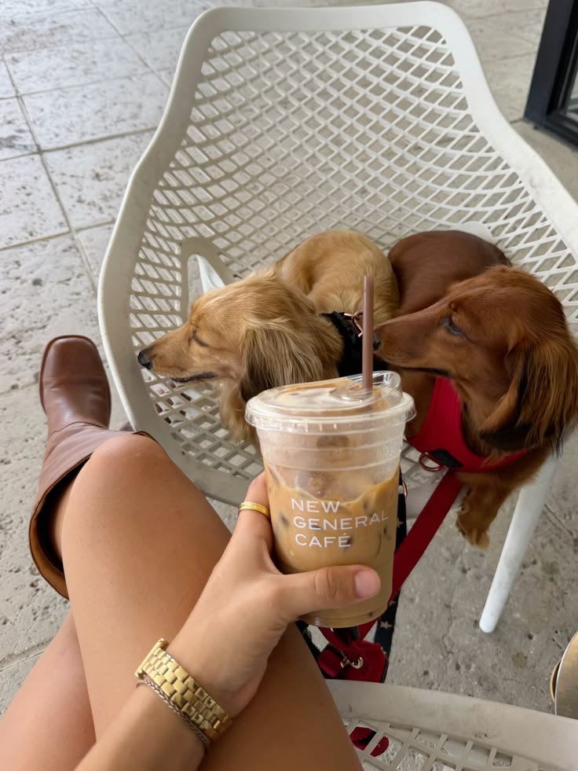

# My First Coding Assignment

## About Me
Hi! My name is Sara Gleim. I am a graduate student at the University of Florida pursuing a Master of Arts in Mass Communications, with a focus in Digital Strategy. I love drinking coffee, hanging out with my friends, watching rom-coms, and going to Gator games!

## Past Coding Experience
I have very little past coding experience. I have worked with basic coding concepts before, but I am still new to HTML, CSS, Git, and GitHub. I am excited to become more comfortable with coding and learn how to build my own website.

## Career Goals
1. Graduate with my Master of Arts in Mass Communications.
2. Start my career in marketing and digital strategy.
3. Work with brands and companies that I am passionate about.